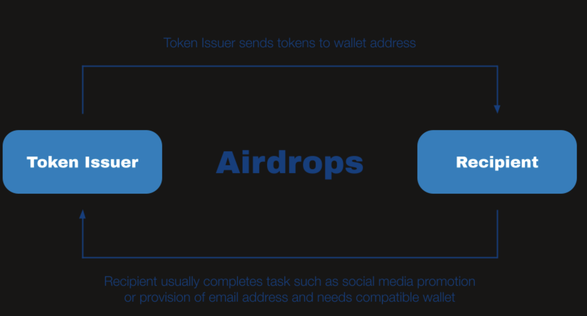
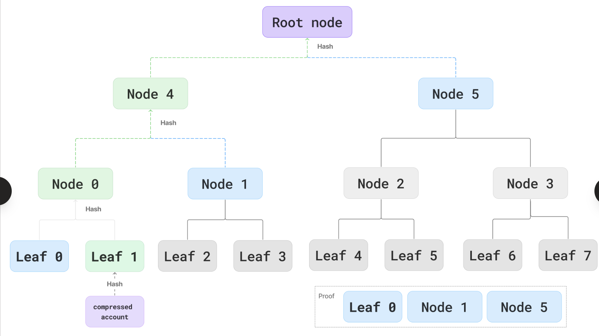

# Merkle-Airdrop

A Merkle airdrop is a token distribution that uses a Merkle tree so the contract only stores a single Merkle root instead of the full recipients list, making it much more gas‑efficient. Off‑chain, you build a tree where each leaf is hash(address, amount); the root gets stored in the airdrop contract. To claim, a user sends their address, amount, and a Merkle proof (sibling hashes) so the contract recomputes the root and checks it equals the stored one. This allows cheap, trustless verification of large airdrops. 

Merkle trees are simple tree-like data structures that use hashing to efficiently verify large sets of data, like transactions or user lists, without checking everything.

## Core Concept

A Merkle tree starts with "leaves" (bottom nodes) made by hashing individual data items, like addresses or transactions. These pair up, get hashed together into parent nodes, and repeat until reaching a single top "root" hash representing all data. A Merkle proof is a short path of sibling hashes from a leaf to the root, proving one item belongs without revealing the full tree

## Common Use Cases
Blockchain Blocks: Stores transactions compactly; the root goes in block headers for quick integrity checks across nodes.

State Verification: Proves account balances or contract states changed correctly, used in Ethereum and Layer 2 rollups.
​

Light Client Proofs: Mobile wallets verify transactions without downloading full blockchain data.
​

File Integrity: Checks if downloaded files match originals, like in torrent

## Airdrop Excellence

Merkle proofs shine in airdrops by storing just the root hash on-chain (cheap gas), not millions of addresses. Users submit their address, claim amount, and proof; the contract recomputes the root to confirm eligibility. This scales for huge lists, prevents spam, and saves costs versus on-chain arrays.
## Merkle Power
They cut storage and computation by 99%+ for verifications, enable trustless systems (no central authority needed), and boost scalability in DeFi or rollups

## Resources

https://www.youtube.com/watch?v=OEpXnyTgjmk
